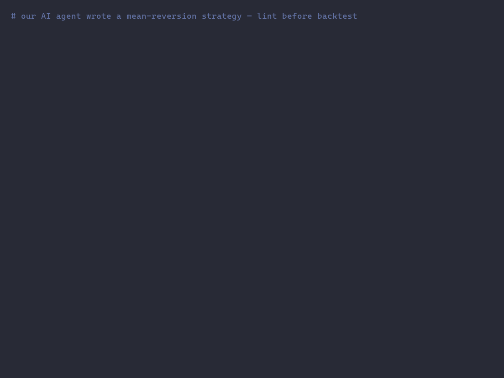

# leakguard-mcp

**Squawk for backtests.** A local-first MCP server that static-analyzes agent-generated
Python code and flags **lookahead bias & data leakage** *before* the backtest runs.

Works for any time-series ML code — quant trading (crypto, equities, forex, futures),
demand forecasting, energy, weather, IoT sensors — wherever a wrong `.shift()` or a
global normalization silently poisons your results.

- Pure source analysis (libcst) — **your code never leaves the machine**, no API calls.
- Heuristic, not a proof: severity tiers (🔴 error / 🟡 warning), like an aviation squawk.
- Framework-agnostic: pandas / numpy / polars, any stack.
- MCP-native (stdio): works directly inside Claude Code, Cursor, and any MCP-compatible agent.
- **All 10 rules ship free** — no license, no tiers, no phone-home.



---

## Why this exists

AI agents (Claude Code, Cursor) write feature engineering and strategy code faster than
humans can review it. But they introduce lookahead bias *at scale* — subtle time-boundary
errors that backtest perfectly and fail catastrophically in live trading or production:

```python
# Agent writes this — looks fine, is catastrophically wrong
df['momentum'] = df['close'].shift(-5)   # uses FUTURE prices as a feature
df['vol_norm'] = (df['close'] - df['close'].mean()) / df['close'].std()  # leaks future mean
```

leakguard catches these in the same agent loop — before the backtest runs:

```
LG001 🔴 line 2: Future shift used as feature — shift(-5) references 5 bars ahead.
  Fix: df['momentum'] = df['close'].shift(5)   (lag, not lead)

LG003 🔴 line 3: Global-fit normalization — mean/std computed over the full series
  before any train/test split, leaking future statistics into the past.
  Fix: df['vol_norm'] = (df['close'] - df['close'].expanding().mean()) / df['close'].expanding().std()
```

The agent reads the finding + fix snippet and self-corrects in one turn. No human review needed.

---

## Install

### Requirements
- Python 3.11+
- [uv](https://docs.astral.sh/uv/) (recommended) or pip

### From PyPI
```bash
pip install leakguard-mcp
```

### From source
```bash
git clone https://github.com/doazvjettu/leakguard-mcp
cd leakguard-mcp
uv sync
```

---

## Setup with Claude Code

Add to your MCP config (`~/.claude/claude_desktop_config.json` or `.claude/settings.json`
in your project):

```json
{
  "mcpServers": {
    "leakguard": {
      "command": "python",
      "args": ["-m", "leakguard.server"]
    }
  }
}
```

Or if installed via uv:
```json
{
  "mcpServers": {
    "leakguard": {
      "command": "uv",
      "args": ["run", "python", "-m", "leakguard.server"]
    }
  }
}
```

Restart Claude Code. leakguard's tools are now available to the agent.

### Setup with Cursor

Add the same block under `mcpServers` in your Cursor MCP settings file.

---

## MCP Tools

| Tool | Description |
|---|---|
| `lint_code(code)` | Analyze a code string, return findings |
| `lint_file(path)` | Analyze a file on disk |
| `lint_paths(glob)` | Analyze all matching files |
| `list_rules()` | List all rules with severities |
| `explain_rule(rule_id)` | Full rationale + fix patterns for a rule |

---

## CLI

The same scanner is available as a CLI — handy for a pre-commit hook or CI step (exits
non-zero when leakage is found):

```bash
uv run leakguard path/to/strategy.py
# or, installed:  leakguard path/to/strategy.py
```

It prints each finding with its severity, line/col, and a concrete fix snippet — the
same output shown in the demo above.

---

## Rules

All 10 rules active, no tiers:

| ID | Severity | Pattern |
|---|---|---|
| LG001 | 🔴 | Future shift as feature: `shift(-n)` / `diff(-n)` / `pct_change(-n)` |
| LG002 | 🔴 | Centered windows: `rolling(center=True)` |
| LG003 | 🔴 | Global-fit scaling: `StandardScaler().fit(full_df)` / hand-rolled mean-std before split |
| LG004 | 🔴 | Shuffled time-series split: `train_test_split` default, `KFold`, `cross_val_score(cv=n)` |
| LG005 | 🔴 | Label leakage: future-derived target column reused in features |
| LG006 | 🟡 | Whole-history aggregates as features: `.max()` / `.mean()` over full series |
| LG007 | 🔴 | Backfill imputation: `bfill()` / `fillna(method='bfill')` |
| LG008 | 🔴 | Forward asof-joins: `merge_asof(direction='forward'/'nearest')` |
| LG009 | 🟡 | Resample label/closed mismatch on bar timestamps |
| LG010 | 🟡 | `groupby().transform()/agg()` spanning train/test boundary |

Each finding includes a **concrete fix snippet** so the calling agent can self-correct immediately.

---

## Benchmark

Measured on two labeled corpora, 49 snippets total.
Reproduce with `uv run python -m benchmark.run`.

**Honesty note:** the trading corpus was written by the tool's author — treat its numbers
as *regression fixtures*, not independent validation. The general-ML corpus is one arm's
length removed in domain (author-composed reproductions of widely documented leakage
anti-patterns, not a downloaded public dataset). The corpus deliberately includes
adversarial snippets the scanner is known to miss; they are counted against it.

**Trading corpus — 39 snippets (23 leaky, 16 clean + hard negatives):**

| Rule | Precision | Recall | TP | FP | FN |
|------|-----------|--------|----|----|----|
| LG001 | 75% | 100% | 6 | 2 | 0 |
| LG002 | 100% | 100% | 5 | 0 | 0 |
| LG003 | 75% | 100% | 3 | 1 | 0 |
| LG004 | 100% | 100% | 4 | 0 | 0 |
| LG005 | 100% | 100% | 5 | 0 | 0 |
| LG006 | 100% | 100% | 5 | 0 | 0 |
| LG007 | 100% | 100% | 5 | 0 | 0 |
| LG008 | 100% | 100% | 2 | 0 | 0 |
| LG009 | 75% | 100% | 3 | 1 | 0 |
| LG010 | 100% | 100% | 2 | 0 | 0 |
| **Overall** | **91%** | **100%** | 40 | 4 | 0 |

**General-ML corpus — 10 snippets (LG003/LG004/LG010):**
Precision 88%, Recall 100% (TP 7 / FP 1 / FN 0).

**Combined: Precision 90.4%, Recall 100% (TP 47 / FP 5 / FN 0).**

Recall is 100% *on this corpus* — every adversarial miss exposed has since been fixed
(constant propagation, hand-rolled normalization, `cv=<int>`, drop-based selection).
Leak shapes not yet in the corpus are still missed — see Known Limitations below.

### Known false positives (clean code that gets flagged)

- **LG001:** a forward-return *label* built with a negative shift and used only as `y` —
  pure AST cannot distinguish a target column from a feature.
- **LG003:** fit inside a helper *defined above* the split call site — line-order heuristic
  confuses definition order with execution order.
- **LG004:** shuffled splits on genuinely non-temporal data — no datetime-index inference yet.
- **LG009:** resampling for reporting/plotting rather than features — intent is invisible to
  static analysis.

### Known false negatives (leak shapes not yet covered)

- **LG004:** `cross_val_score(...)` with `cv` *omitted* (defaults to KFold).
- **LG005:** taint through `df.loc[:, 'col'] = ...` or `df.assign(col=...)`.
- **All rules:** values flowing through function calls, dicts, or non-constant variables —
  no cross-function dataflow.

These sets are pinned in `tests/test_benchmark.py`: any new miss *or* silent fix fails the
suite until docs and corpus are updated to match.

---

## Develop

```bash
uv sync --extra dev
uv run pytest                              # 96 tests
uv run python -m leakguard.server          # stdio MCP server
uv run leakguard demo/strategy_leaky.py    # CLI on the demo file
uv run python -m benchmark.run             # precision/recall tables + FP/FN lists
```

The scanner core lives in `leakguard/core/` (pure, no MCP imports); `server.py` and
`cli.py` are thin wrappers. Each rule has a fixture pair under `tests/fixtures/`.

---

## Limitations (v1)

- Heuristic static analysis — catches ~90% of common patterns, not 100%.
- Single-file only — no cross-module taint tracking.
- Python only (pandas / numpy / polars).
- No runtime execution — cannot catch patterns that only emerge at runtime.

Contributions welcome: new corpus snippets (especially real bugs you've hit) strengthen the
benchmark more than new rules do.
